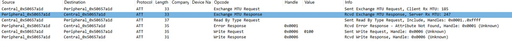
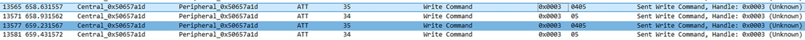

.. _att-analysis:

Attribute Protocol (ATT) Payload Analysis
=========================================

This chapter focuses on the deep decoding of the Attribute Protocol (ATT) payloads exchanged via the proprietary Service UUID (``6e40...0001``).

Based on the sniffed traffic, the roles of the key ATT handles have been identified as follows:

- **Handle ``0x0003``** → Command Channel (WRITE / TX)
- **Handle ``0x0005``** → Notification Channel (NOTIFY / RX)
- **Handle ``0x0006``** → Client Characteristic Configuration Descriptor (CCCD)

These handles form a simple but robust proprietary protocol layered on top of ATT.

-----------------------------------------------------------------------

1. Connection and Initialization Sequence (Handshake)
-----------------------------------------------------

Every communication session between the application (Central) and the device (Peripheral) follows a precise and repeatable initialization sequence.

.. list-table:: Connection and Initialization Sequence
   :header-rows: 1
   :widths: 20 20 10 10 15 35

   * - Step
     - Example Packet
     - Protocol
     - Handle
     - Value
     - Description
   * - MTU Negotiation
     - ``33`` (Exchange MTU Req / Rsp)
     - ATT
     - —
     - —
     - Negotiates the Maximum Transmission Unit (typically up to 247 bytes).
   * - Enable Notifications (CCCD)
     - ``35`` (Write Request)
     - ATT
     - ``0x0006``
     - ``0100``
     - Enables notifications for Handle ``0x0005``.
   * - Initial Handshake / Ping
     - ``34`` (Write Command)
     - ATT
     - ``0x0003``
     - ``20``
     - Initial keep-alive command used to wake the device and request status.

Once this sequence is completed, the device starts emitting notifications asynchronously.

Here the related sniff

   
-----------------------------------------------------------------------

2. Command Structure and Mode Mapping (Handle 0x0003)
-----------------------------------------------------

All control commands sent to the device share a **fixed 2-byte structure**:

::

   [ Opcode ] [ State ID ]

The most common opcode is ``0x02``, which is used to control light color and operating mode.

Metis Reaction Protocol: Command Specification
----------------------------------------------

This document describes the 8-bit command structure used to control the Metis devices. Through reverse engineering of the communication logs, the command byte has been decoded into a specific bitmask.

Command Byte Structure
----------------------

Each command consists of a single byte (8 bits). The functions are mapped as follows:

+-------+-------+-------+-------+-------+-------+-------+-------+
| Bit 7 | Bit 6 | Bit 5 | Bit 4 | Bit 3 | Bit 2 | Bit 1 | Bit 0 |
+-------+-------+-------+-------+-------+-------+-------+-------+
|   Sensor Mode | Flash | Touch | Start |     Color     | Fixed |
+-------+-------+-------+-------+-------+-------+-------+-------+

Detailed Bit Definitions
------------------------

**Sensor Mode (Bits 7-6)**
  Determines the sensitivity and the trigger type:
  * ``00``: Nearby / Close range
  * ``01``: Far range
  * ``10``: Small Vibrations
  * ``11``: Large Vibrations

**Flash (Bit 5)**
  Controls the visual flash effect:
  * ``0``: Flash OFF
  * ``1``: Flash ON

**Touch-Sound Disable (Bit 4)**
  *Note: This bit uses inverted logic.*
  * ``0``: Feedback Sound ON
  * ``1``: Feedback Sound OFF

**Startup-Sound (Bit 3)**
  * ``0``: Sound at startup OFF
  * ``1``: Sound at startup ON

**Color Selection (Bits 2-1)**
  Defines the LED color of the device:
  * ``00``: Red
  * ``01``: Yellow
  * ``10``: Blue
  * ``11``: Green (Hypothesized)

**Fixed Control (Bit 0)**
  * Always set to ``1``. This bit likely acts as a command identifier for the receiver.

Reference Table
---------------

Below are common commands derived from the protocol analysis:

.. list-table:: Verified Commands
   :widths: 15 15 25 15 15 15
   :header-rows: 1

   * - Hex
     - Binary
     - Sensor Mode
     - Flash
     - Color
     - Startup Sound
   * - ``01``
     - ``0000 0001``
     - Nearby
     - No
     - Red
     - No
   * - ``41``
     - ``0100 0001``
     - Far
     - No
     - Red
     - No
   * - ``a1``
     - ``1010 0001``
     - Small Vib.
     - Yes
     - Red
     - No
   * - ``fb``
     - ``1111 1011``
     - Large Vib.
     - Yes
     - Yellow
     - Yes
   * - ``fd``
     - ``1111 1101``
     - Large Vib.
     - Yes
     - Blue
     - Yes

Implementation Notes
--------------------

When implementing the command generator, ensure the **Bit 4** logic is handled correctly, as setting it to ``1`` will mute the touch feedback sound. The **Bit 0** must always be high to ensure the packet is recognized by the Metis hardware.

.. image:: _static/InitSequence.jpg
   :alt: Metis Initialization Sequence Diagram
   :align: center
   :width: 80%

~~~~~~~~~~~~~~~~~~~~~~~~~~~~~~~~~~~~~~
2.1 Core Command Set
~~~~~~~~~~~~~~~~~~~~~~~~~~~~~~~~~~~~~~

.. list-table:: Core Command Set
   :header-rows: 1
   :widths: 30 15 10 10 35

   * - Action (App Event)
     - Hex Payload
     - Opcode
     - State ID
     - Description
   * - Keep Alive / Ping
     - ``20``
     - ``0x20``
     - —
     - Periodic keep-alive command used to maintain synchronization.
   * - Turn Off / Reset
     - ``04 05`` → ``05``
     - ``0x04`` / ``0x05``
     - —
     - Universal command sequence used to stop the current illumination or activity.
   * - Set Color: RED (Default / Audio)
     - ``02 89``
     - ``0x02``
     - ``0x89``
     - Sets RED light in default mode (audio enabled).
   * - Set Color: RED (Mute)
     - ``02 91``
     - ``0x02``
     - ``0x91``
     - Sets RED light with audio muted.
   * - Set Color: RED (Flash)
     - ``02 A1``
     - ``0x02``
     - ``0xA1``
     - Sets RED light in flash mode.
   * - Set Color: RED (Vibration)
     - ``02 C1``
     - ``0x02``
     - ``0xC1``
     - Sets RED light with vibration enabled.
   * - Set Color: GREEN
     - ``02 8A``
     - ``0x02``
     - ``0x8A``
     - Sets the light to GREEN.
   * - Set Color: YELLOW
     - ``02 8B``
     - ``0x02``
     - ``0x8B``
     - Sets the light to YELLOW.
   * - Set Color: BLUE
     - ``02 8C``
     - ``0x02``
     - ``0x8C``
     - Sets the light to BLUE.
   * - Set Color: WHITE / Special
     - ``02 CC``
     - ``0x02``
     - ``0xCC``
     - Hypothesized WHITE or special high-intensity state.

~~~~~~~~~~~~~~~~~~~~~~~~~~~~~~~~~~~~~~
2.2 State ID (Byte 2) Bit Encoding
~~~~~~~~~~~~~~~~~~~~~~~~~~~~~~~~~~~~~~

The **State ID** byte is interpreted as a **bitmask** controlling both the base color and optional features.

.. list-table:: State ID Bit Encoding
   :header-rows: 1
   :widths: 25 15 40

   * - Bit
     - Hex Value
     - Feature Control
   * - Bit 6 (64)
     - ``0x40``
     - Vibration mode toggle (0 = OFF, 1 = ON).
   * - Bit 5 (32)
     - ``0x20``
     - Flash mode toggle (0 = OFF, 1 = ON).
   * - Bit 4 (16)
     - ``0x10``
     - Audio mute toggle (0 = Audio ON, 1 = MUTE).
   * - Bit 3 (8)
     - ``0x08``
     - Secondary audio or color-related feature (hypothesized).
   * - Remaining bits
     - Varies
     - Encode the base color identifier.

-----------------------------------------------------------------------

3. Event and Notification Structure (Handle 0x0005)
---------------------------------------------------

The device emits notifications whenever a state change or physical event (e.g. touch / hit) occurs.

~~~~~~~~~~~~~~~~~~~~~~~~~~~~~~~~~~~~~~
3.1 Core Notification Set
~~~~~~~~~~~~~~~~~~~~~~~~~~~~~~~~~~~~~~

.. list-table:: Core Notification Set
   :header-rows: 1
   :widths: 30 20 10 10 40

   * - Event (Device → Host)
     - Hex Payload Example
     - Opcode
     - Data
     - Description
   * - Status Response
     - ``21 03 87 01``
     - ``0x21``
     - Varies
     - Response to the ``0x20`` ping. Indicates connection, session or battery status.
   * - Sensor Data Stream
     - ``03 00 A0 03``
     - ``0x03``
     - Varies
     - Real-time event stream while a light is active (hit detection, feedback, intensity).

-----------------------------------------------------------------------

4. Power off sequence
-----------------------------------------------------

Here the related sniff

