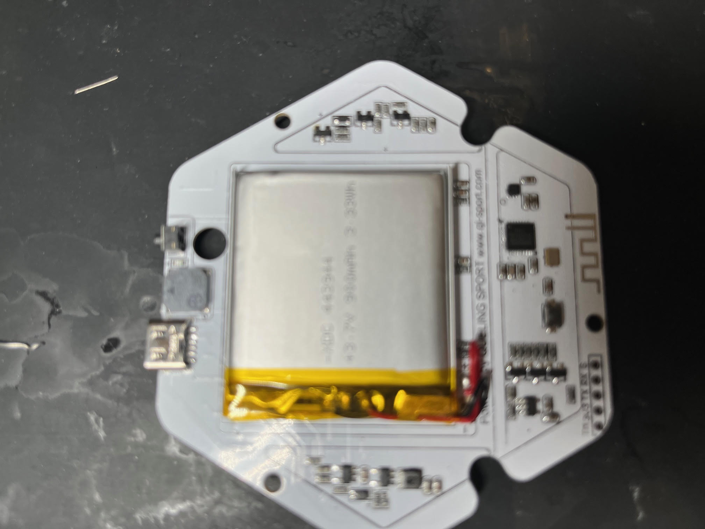
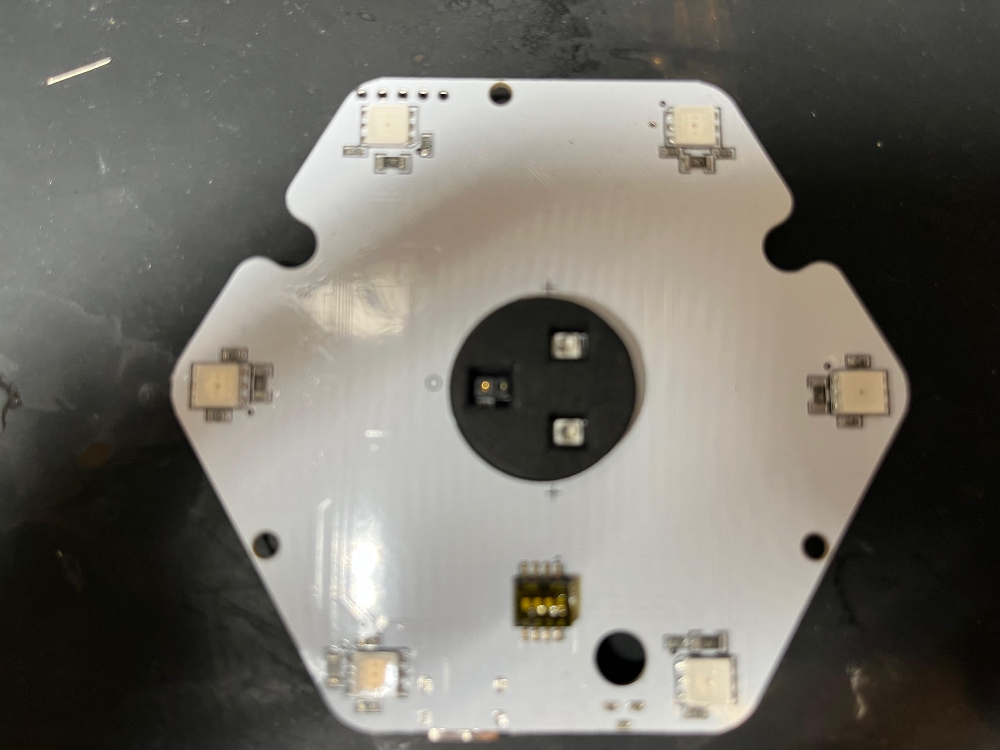

.. _hardware-overview:

Hardware Overview
=================

This section describes the hardware architecture of the METIS Reaction Light
device, based on physical disassembly, PCB inspection, and cross-referencing
with the identified microcontroller datasheet.

The goal of this chapter is to document **what is physically present on the
device**, distinguishing between *confirmed components* and *reverse-engineered
assumptions*.

   

---

Device Architecture Overview
-----------------------------

The METIS device is a compact, battery-powered BLE system designed for fast
reaction training. Its architecture follows a classic **single-MCU BLE design**
with integrated sensing, visual feedback, and haptic/audio outputs.

High-level components:

- BLE System-on-Chip (SoC)
- Li-Po battery with onboard charging
- RGB LED emitters
- Proximity / touch sensor
- Vibration motor and buzzer
- PCB integrated antenna

---

Main Processing Unit
--------------------

The central component of the device is a **32-bit ARM Cortex-M0 based SoC** with
integrated Bluetooth Low Energy radio.

Based on datasheet matching and observed hardware capabilities, the processor
features the following characteristics:

+----------------------+------------------------------------------------+
| Feature              | Specification                                  |
+======================+================================================+
| CPU Core             | 32-bit ARM® Cortex™-M0                         |
+----------------------+------------------------------------------------+
| Flash Memory         | 512 KB (firmware storage)                      |
+----------------------+------------------------------------------------+
| SRAM                 | 138 KB (runtime, BLE stack, buffers)           |
+----------------------+------------------------------------------------+
| Radio                | 2.4 GHz BLE 5.0 compliant                      |
|                      | (1M, 2M, 500K, 125K PHY)                       |
+----------------------+------------------------------------------------+
| Operating Voltage    | 1.8 V – 3.6 V                                  |
+----------------------+------------------------------------------------+

`Download the PHY6212 Datasheet <_static/PHY6212_Datasheet.pdf>`_

This configuration is consistent with:

- BLE 5.0 features observed at protocol level
- large ATT MTU support
- frequent notification traffic
- low-power battery operation

The SoC integrates the BLE controller, host stack support, and application
firmware on a single chip.

---

Radio and Antenna
-----------------

The PCB includes a **printed inverted-F antenna** etched directly on the board,
connected to the RF output of the SoC via a short matching network.

Observed characteristics:

- No external RF module
- No shielded can (cost-optimized design)
- Short RF trace path
- Optimized for short-range indoor usage

This matches the operational profile of reaction-training devices.

---

Power System
------------

The device is powered by a **single-cell Li-Po battery**, directly soldered to
the PCB.

Observed features:

- Nominal battery voltage: ~3.7 V
- Integrated charging circuit
- Likely USB-based charging via test pads or pogo contacts
- Onboard voltage regulation for MCU and peripherals

The MCU operating range (1.8–3.6 V) allows efficient direct battery operation
without complex power stages.

---
Debug Port (PCB Headers)
------------------------

The PCB exposes a 5-pin header for factory testing and debugging:

* **VCC (3.3V):** Logic power supply.
* **GND:** Common ground.
* **TX (Transmit):** Serial output from the PHY6212 (3.3V TTL).
* **RX (Receive):** Serial input to the PHY6212 (3.3V TTL).
* **TM (Test Mode):** Used to trigger ISP (In-System Programming) mode.

.. warning::
   The UART interface operates at **3.3V logic levels**. Connecting 5V 
   signals will permanently damage the SoC.
Output Components
-----------------

### LEDs

The front PCB hosts multiple high-intensity LEDs arranged radially.

- Likely RGB LEDs (single package or discrete channels)
- Individually controlled via MCU GPIO or PWM
- Used for color and flash patterns identified in the BLE protocol

### Vibration Motor

A vibration motor is present and controlled by the MCU, consistent with:

- “Small vibration” and “large vibration” modes
- State bits identified in the ATT protocol analysis

### Audio Output

An onboard buzzer or piezo element provides sound feedback.

- Sound can be enabled or muted via protocol commands
- Used for touch or hit confirmation

---

Sensors
-------

The central area of the front PCB includes a **touch or proximity sensor**.

Evidence suggests:

- Capacitive or optical sensing
- Direct MCU connection
- High-frequency event reporting via BLE notifications

The sensor output is encoded in notification payloads observed on
ATT Handle ``0x0005``.

---

Debug and Test Interfaces
-------------------------

The PCB exposes multiple unpopulated pads and headers, likely used for:

- Factory programming
- Debug (SWD or UART)
- Functional testing

These interfaces are not accessible in the consumer enclosure but are useful
reference points for reverse-engineering and firmware analysis.

---

Hardware Summary
----------------

The METIS Reaction Light uses a **modern, highly integrated BLE SoC** combined
with minimal external components to achieve:

- Low power consumption
- Fast reaction times
- Reliable BLE communication
- Cost-efficient manufacturing

This hardware design strongly influences the structure of the BLE protocol and
the behavior observed during ATT traffic analysis.

---