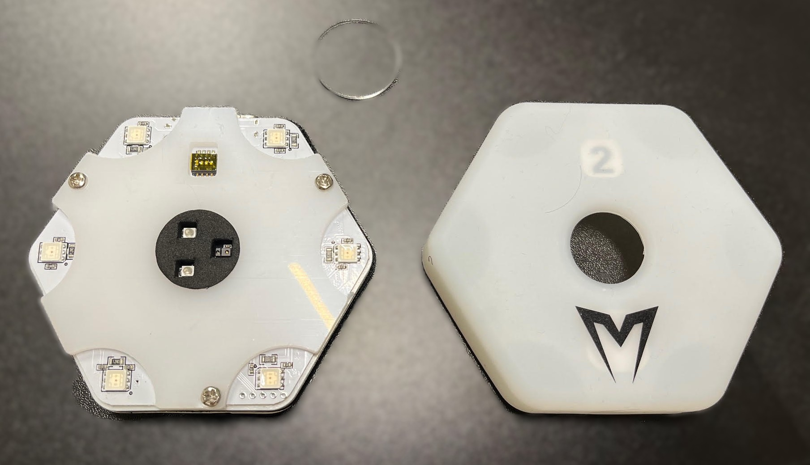

.. METIS FORZA Reaction Lights BLE Protocol Documentation
.. =================================================

.. *********************************************************************************
.. DISCLAIMER
.. *********************************************************************************

.. attention::
   **DISCLAIMER**

   This documentation is the result of **Reverse Engineering** of the Bluetooth Low Energy (BLE) protocol used by METIS Forza Reaction Lights devices. It is intended strictly for **educational, analytical, and experimental purposes**.

   The author(s) of this documentation and the associated code are **not affiliated with, endorsed by, or sponsored by METIS** or its parent companies. Use of this information may violate the terms of service or warranty agreements of the original manufacturer. Proceed at your own risk.

METIS FORZA Reaction Lights: BLE Protocol Analysis (WIP)
============================================

Welcome to the documentation for the reverse-engineered METIS Reaction Lights devices.

The goal of this project is to fully document the Hardware and the Attribute Protocol (ATT) commands, Service UUIDs, and Characteristics necessary to communicate directly with the devices, enabling custom integration and independent application development beyond the official software.

Device Overview
---------------

The METIS FORZA Reaction Lights are portable, sensor-equipped training devices utilized primarily in sports performance and neuro-training contexts. They communicate wirelessly to coordinate drills involving light activation and touch/proximity detection.

Contextual Resources
--------------------

For context regarding the device functionality and use case, the following resource is useful:

* `METIS Reaction Lights | Reaction Training - YouTube <https://www.youtube.com/watch?v=i3YOfDJhfew>`_

* `METIS Reaction Lights | Selled here (or Amazon) <https://www.networldsports.it/luci-di-reazione-per-allenamento>`_

* `METIS Reaction Lights | Built here <https://ql-sport.com/>`_

Table of Contents
-----------------

.. toctree::
   :maxdepth: 2
   :caption: Documentation Sections

   hardware
   ble_protocol
   att_analysis
   tools

Support and Contribution
------------------------

This is an open-source analytical effort. Contributions, corrections, and new findings are highly welcome!

Please refer to the :doc:`tools` section for information on how the data was captured and analyzed.

The project repository is on `GitHub <https://github.com/cromagn/metis-reaction-protocol>`_.

