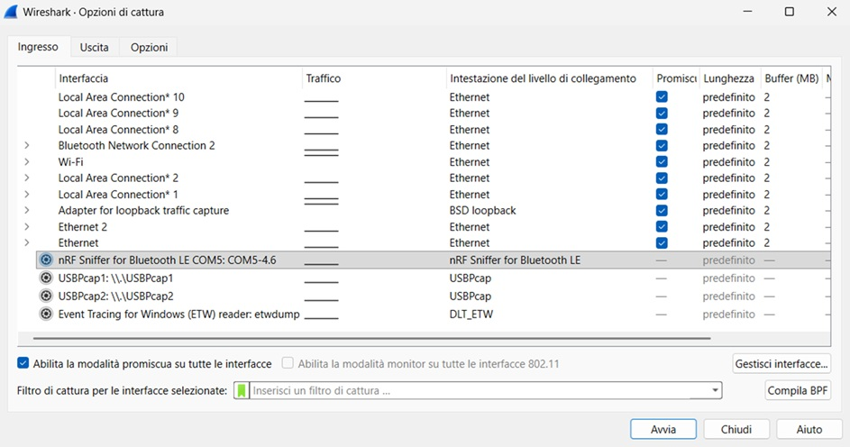
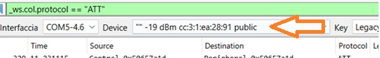
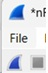

.. _tools:

How to sniff
============

Tools:
------

- `nRF Util <https://www.nordicsemi.com/Products/Development-tools/nRF-Util>`_

- `Wireshark <https://www.wireshark.org/>`_

- `Hardware <https://it.aliexpress.com/item/1005009621898979.html>`_

Step by step guide:
-------------------

1. Set the correct probe

   
2. Choose the correct MAC

   
3. Start sniffing (Play)

4. Filter by:

:kbd:`_ws.col.protocol == "ATT"` to sniff the ATT command

:kbd:`frame contains "re"` to sniff the MAC using the name of the devices
